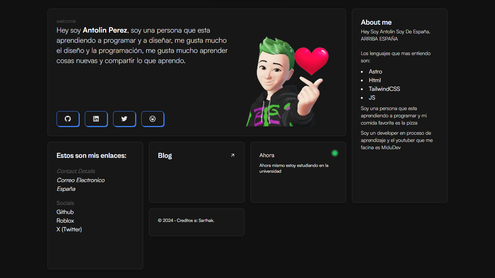

# Sarthak Bento Portfolio



Go to my portfolio **[click here]()**

## Tech Stack

- [Astro](https://astro.build)
- [unocss](https://unocss.dev/)
- [motion](https://motion.dev/)
- [d3](https://d3js.org/)

# Steps

```bash
# Clone this repository
$ git clone https://github.com/sarthakxv/astroboy
```

```bash
# Go into the repository
$ cd astroboy
```

> You can use `npm` or `yarn`, I'm using `pnpm`.

```bash
# Install dependencies
$ pnpm install
```

```bash
# Start the project in development
$ pnpm run dev
```

# Configuration

remember to replace the `site` and other properties with your data in `astro.config.mjs`
